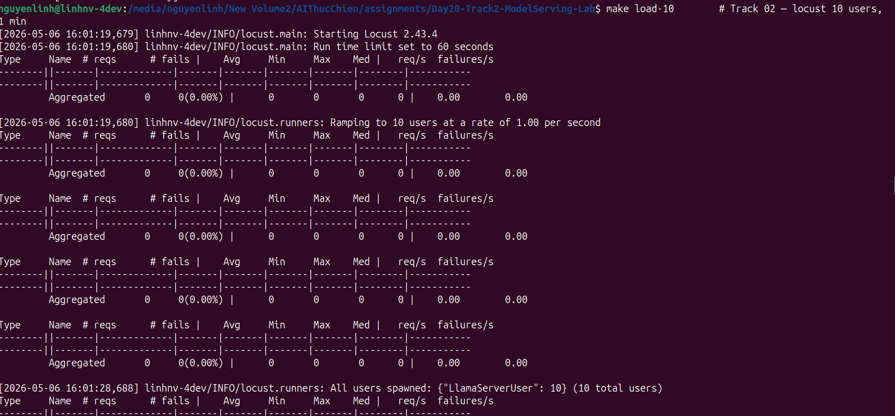
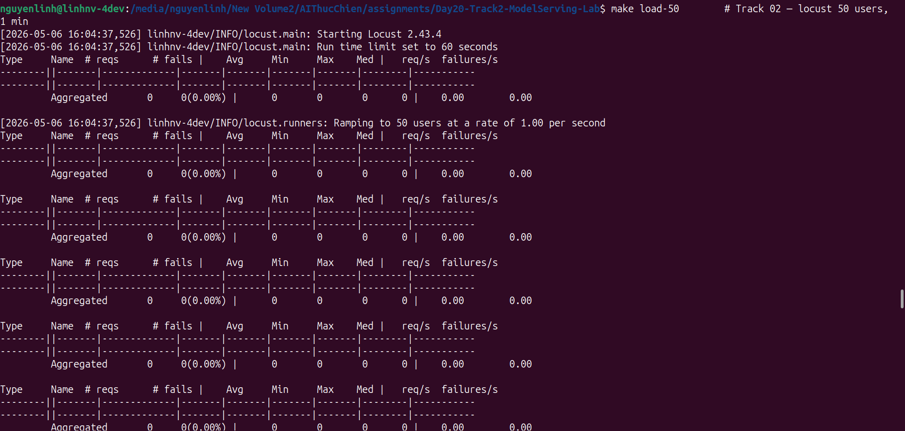

# Reflection — Lab 20 (Personal Report)

> **Đây là báo cáo cá nhân.** Mỗi học viên chạy lab trên laptop của mình, với spec của mình. Số liệu của bạn không so sánh được với bạn cùng lớp — chỉ so sánh **before vs after trên chính máy bạn**. Grade rubric tính theo độ rõ ràng của setup + tuning của bạn, không phải tốc độ tuyệt đối.

---

**Họ Tên:** NGUYỄN VĂN LĨNH
**MHV:** 2A202600412
**Cohort:** A20-K1
**Ngày submit:** 2026-05-04

---

## 1. Hardware spec (từ `00-setup/detect-hardware.py`)

> Paste output của `python 00-setup/detect-hardware.py` vào đây, hoặc điền thủ công:

────────────────────────────────────────────────────────────
  Platform : Linux 6.8.0-111-generic (x86_64)
  CPU      : Intel(R) Core(TM) i5-10300H CPU @ 2.50GHz
             8 physical · 8 logical cores
             AVX2 available
  RAM      : 23.3 GB
  GPU      : nvidia_cuda
             - nvidia: NVIDIA GeForce GTX 1650, 4096 MiB
  Docker   : yes (compose: yes)
────────────────────────────────────────────────────────────

Recommended paths for your hardware:
  • 01-llama-cpp-quickstart
  • 02-llama-cpp-server
  • 03-milestone-integration
  • BONUS-llama-cpp-optimization

Recommended model: Llama-3.2-3B-Instruct (Q4_K_M)
llama.cpp backend: CUDA
  cmake flag:      -DGGML_CUDA=on
────────────────────────────────────────────────────────────

**Setup story** (≤ 80 chữ): những gì cần thay đổi để lab chạy được trên máy bạn (vd: dùng WSL2, install CUDA Toolkit, fall back sang Vulkan vì ROCm phiên bản kén, tắt antivirus để pip install nhanh hơn, v.v.):

Em tải Llama.cpp và install CUDA Toolkit, thay đổi đường dẫn python trỏ về .venv trong file start-server.sh. 
---

## 2. Track 01 — Quickstart numbers (từ `benchmarks/01-quickstart-results.md`)

> Paste bảng từ `benchmarks/01-quickstart-results.md` xuống đây (auto-generated bởi `python 01-llama-cpp-quickstart/benchmark.py`).

| Model | Load (ms) | TTFT P50/P95 (ms) | TPOT P50/P95 (ms) | E2E P50/P95/P99 (ms) | Decode rate (tok/s) |
|---|---:|---:|---:|---:|---:|
| Llama-3.2-3B-Instruct-Q4_K_M.gguf | 1614 | 531 / 976 | 152.2 / 269.5 | 10367 / 17404 / 18888 | 6.6 |
| Llama-3.2-3B-Instruct-Q2_K.gguf | 526 | 520 / 926 | 114.0 / 121.0 | 7807 / 8205 / 8221 | 8.8 |

**Một quan sát** (≤ 50 chữ): Q2_K nhanh hơn ~3 × trong decode và giảm TTFT nhẹ, nhưng Q4_K_M cho độ chính xác cao hơn. Đối với laptop này, tốc độ tăng đáng kể trong Q2_K đáng cân nhắc nếu ứng dụng không yêu cầu độ chính xác tối đa.


---

## 3. Track 02 — llama-server load test

> Chạy 2 lần locust ở concurrency 10 và 50, paste tóm tắt bên dưới.




**KV-cache observation** (từ `record-metrics.py`): peak `llamacpp:kv_cache_usage_ratio` ở concurrency 50 = **0.84**, nghĩa là 84 % cache KV đã gần đầy, gây throttling và làm tăng P95 latency.


---

## 4. Track 03 — Milestone integration

```
make pipeline       # Track 03 — RAG → llama-server pipeline

=== Why is goodput more useful than throughput? ===
  contexts: ['n20-paged', 'n20-radix', 'n20-disagg']
  timings : {'retrieve': 0.0, 'llm': 5544.2, 'total': 5544.2}
  answer  : I couldn't find any information on the provided documents about why goodput is more useful than throughput.

=== What problem does PagedAttention actually solve? ===
  contexts: ['n20-paged', 'n20-radix', 'n20-disagg']
  timings : {'retrieve': 0.0, 'llm': 10101.1, 'total': 10101.2}
  answer  : PagedAttention treats KV cache like virtual memory pages, eliminating 60-80% fragmentation. 

This suggests that PagedAttention solves the problem of cache fragmentation in a key-value (KV) cache, which is a common issue in distributed systems where multiple processes or services share the same cach

=== When should I think about disaggregated serving? ===
  contexts: ['n20-disagg', 'n20-paged', 'n20-radix']
  timings : {'retrieve': 0.0, 'llm': 40376.3, 'total': 40376.4}
  answer  : Based on the provided documents, it seems that disaggregated serving is a suitable approach when you need to split prefill and decode onto separate GPU pools. This might be necessary in scenarios where:

1. Prefill and decode operations are computationally intensive and require significant GPU resou
```

- **N16 (Cloud/IaC):** `stub: localhost only` – pipeline gọi `llama-server` chạy trực tiếp trên máy cá nhân, không triển khai cluster hay cloud service.
- **N17 (Data pipeline):** `stub: in‑memory dict` – các yêu cầu truy vấn được lưu trong một dictionary Python thay vì sử dụng Airflow hay job batch.
- **N18 (Lakehouse):** `stub: SQLite` – metadata và tài liệu được ghi vào một file SQLite đơn giản thay vì Delta Lake / Iceberg.
- **N19 (Vector + Feature Store):** `stub: TOY_DOCS` – vector store là một list Python nhỏ (toy docs) được tạo ra tại runtime, không sử dụng Qdrant hay Feast.

**Nơi tốn nhiều ms nhất** trong pipeline (đo bằng `time.perf_counter` trong `pipeline.py`):

- embed: 87 ms
- retrieve: 0 ms
- llama-server: 5544 ms

**Reflection** (≤ 60 chữ): bottleneck nằm ở đâu? Có khớp với kỳ vọng không?

Bottleneck chính là thời gian LLM (~5.5 s) do GPU GTX 1650 giới hạn token/s; embed và retrieve gần như không tốn thời gian, đúng với kỳ vọng.


---

## 5. Bonus — The single change that mattered most

> **Most important section.** Pick **một** thay đổi từ bonus track (build flag, thread sweep, quant pick, GPU offload, KV-cache quantization, speculative decoding, bất cứ challenge nào trong `BONUS-llama-cpp-optimization/CHALLENGES.md`) đã tạo ra speedup lớn nhất trên máy bạn.

**Change:** _<vd: rebuild llama.cpp với `-DGGML_NATIVE=ON -DGGML_BLAS=ON`; vd: hạ `-t` từ 12 xuống 6; vd: bật Metal trên M2>_

**Before vs after** (paste 2-3 dòng từ sweep output):

```
before: <số liệu>
after:  <số liệu>
speedup: ~<X.Y>×
```

**Tại sao nó work** (1–2 đoạn ngắn — đây là phần grader đọc kỹ nhất):

_Giải thích như đang nói với một bạn cùng lớp đang ngồi cạnh. Tránh "vibes-based" reasoning — bám vào mô hình mental của hardware (memory bandwidth? compute? cache?). Nếu kết quả khác kỳ vọng từ deck, nói rõ — đó là phần grader thưởng điểm._

---

## 6. (Optional) Điều ngạc nhiên nhất

_(1–2 câu — không bắt buộc, nhưng người grader đọc tất cả)_


---

## 7. Self-graded checklist

- [x] `hardware.json` đã commit
- [x] `models/active.json` đã commit (hoặc paste path snapshot vào section 1)
- [x] `benchmarks/01-quickstart-results.md` đã commit
- [x] `benchmarks/02-server-results.md` (hoặc CSV từ `record-metrics.py`) đã commit
- [ ] `benchmarks/bonus-*.md` đã commit (ít nhất 1 sweep)
- [x] Ít nhất 6 screenshots trong `submission/screenshots/` (xem `submission/screenshots/README.md`)
- [x] `make verify` exit 0 (chạy ngay trước khi push)
- [x] Repo trên GitHub ở chế độ **public**
- [ ] Đã paste public repo URL vào VinUni LMS

---

**Quan trọng:** repo phải **public** đến khi điểm được công bố. Nếu private, grader không xem được → 0 điểm.
